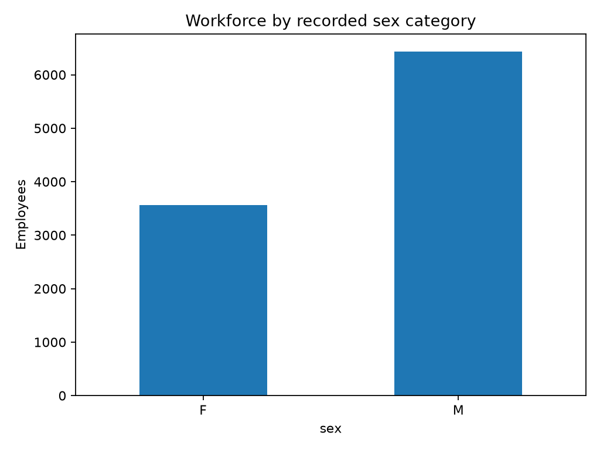
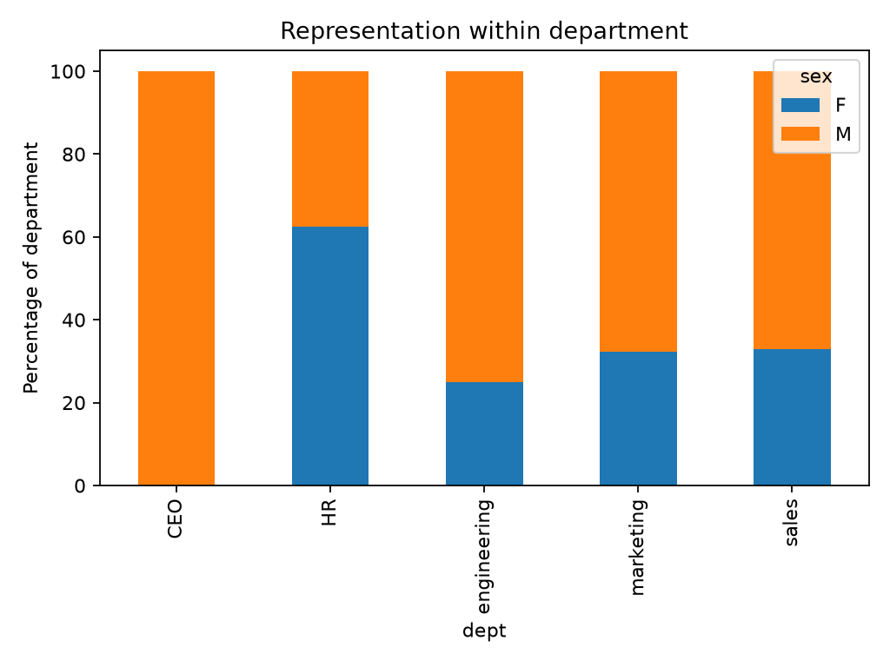
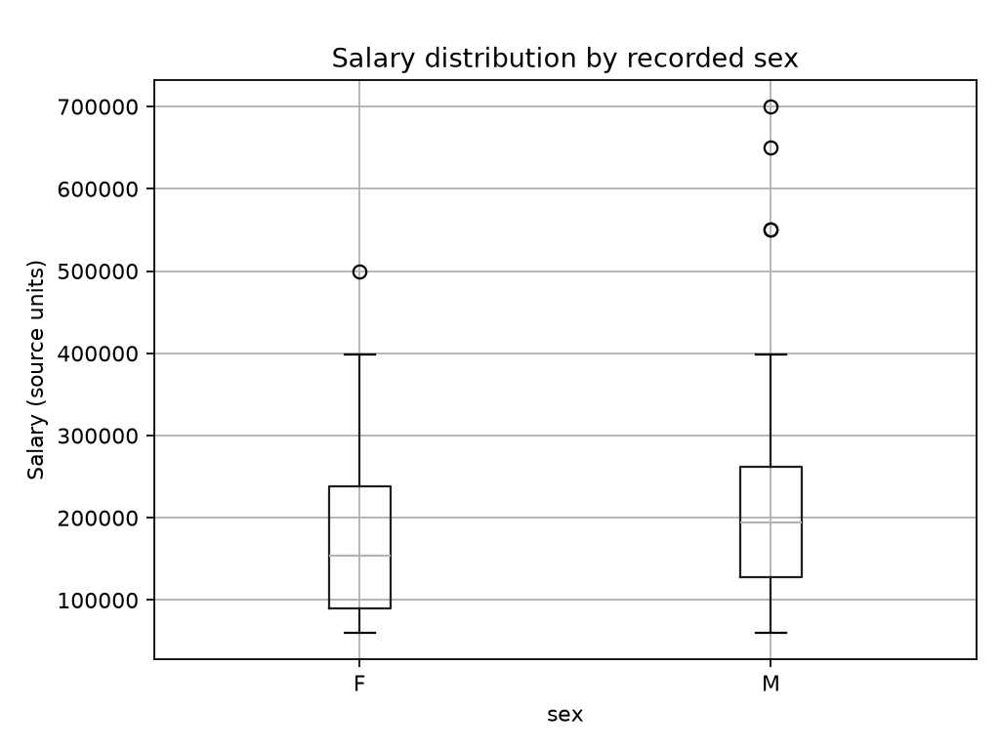
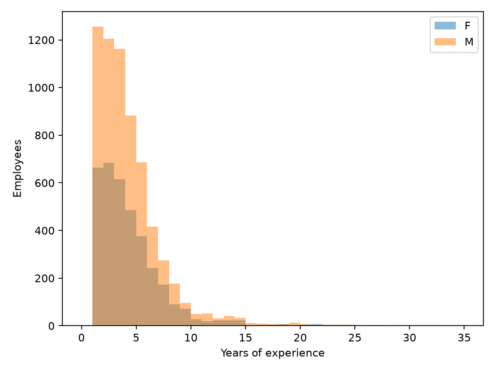
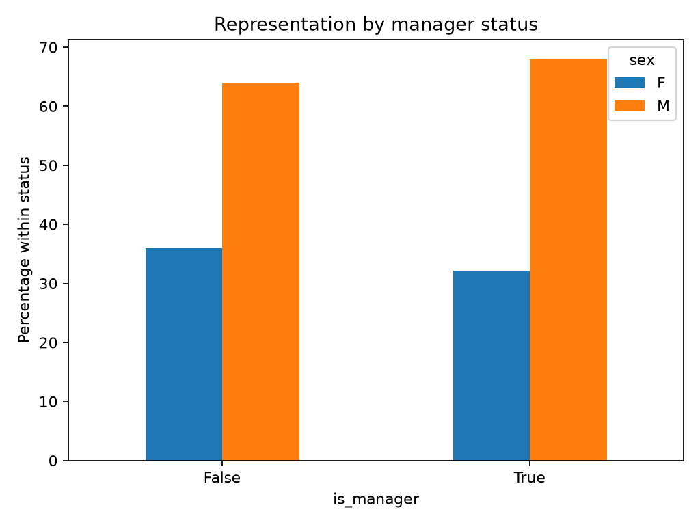

# Workplace Diversity Analysis — Findings

[Introduction](README.md) · [Technical methods](readme.tech.md)

These descriptive results were generated with ChatGPT/Codex assistance from the supplied employee and hierarchy CSVs. All 10,000 employees were retained. F and M are recorded source categories; the analysis does not infer identities beyond those labels.

## Ten Main Analytical Questions

| # | Question | Evidence and interpretation |
| --- | --- | --- |
| 1 | Is the reporting hierarchy connected and valid? | All 10,000 reporting paths reach the CEO. No cycles, missing referenced managers, or disconnected roots were detected. The CEO's missing boss ID is preserved. |
| 2 | How does workforce representation vary overall and by department? | Overall: F = 3,561 (35.61%); M = 6,439 (64.39%). Department percentages use each department's own headcount. Detailed department-level representation information is located in `sex_representation_department.csv`. |
| 3 | How is education distributed across sex categories and departments? | Degree-level counts and within-group percentages are exported for sex, department, and department/sex combinations. Education is not a substitute for job role or grade. |
| 4 | How does experience differ across groups? | Mean recorded experience: F = 3.93 years, M = 3.84 years. Both medians are 3 years. Department-level summaries are also available. Experience does not measure company tenure. |
| 5 | How do salary distributions differ across groups? | Mean salary: F = 171,314.52; M = 198,954.34. Median: F = 154,000; M = 194,000. Values are in source units; currency and salary period are unconfirmed. Group composition may explain part of the difference. |
| 6 | Do differences remain within comparable observed groups? | 272 groups contain both F and M after exact matching on department, degree, experience, and reporting depth. Group differences are exported; cells with fewer than five employees in either category are flagged. These are not fully adjusted pay-equity estimates. |
| 7 | How does the signing-bonus indicator vary? | Indicator 1 occurs for 967 F records (27.16%) and 2,047 M records (31.79%). Interpreting 1 as bonus receipt requires confirmation. Bonus amounts are unavailable. |
| 8 | How does manager representation compare with the workforce? | There are 999 managers with direct reports: 321 F (32.13%) and 678 M (67.87%). Compare F's manager share with its 35.61% workforce share; this is a descriptive difference, not a promotion rate. |
| 9 | How do reporting depth, team size, and team composition vary? | Reporting paths, direct-report counts, and within-team sex percentages are exported. Reporting depth counts links to the CEO and is not a formal job grade. Team composition refers to direct reports. |
| 10 | Which unusual records and missing context warrant follow-up? | Salary IQR flags and numeric/hierarchy checks identify review candidates without removing them. Large salaries can be legitimate, especially for senior roles. Additional job and compensation context is needed. |

Tables referenced above are in [Data/Analysis_Outputs](Data/Analysis_Outputs/). Comparable groups cover only groups containing both source categories; their results should not be generalized to all employees without examining coverage.

## Visual Evidence

## Recommendations and Additional Business Questions

| Additional information | Business question it would help answer |
| --- | --- |
| Job title, job family, and formal grade | Are employees being compared within equivalent roles and responsibility levels? |
| Location, currency, salary period, working hours, and employment type | Are compensation figures measured on a comparable basis? |
| Company tenure and relevant prior experience | Does tenure and role-specific experience explain observed differences? |
| Performance measures and compensation policy | Which documented criteria determine pay and bonuses? |
| Hiring, promotion, application, and departure dates | How does representation change over time, and at which stages? |
| Bonus definition, eligibility, amounts, and offer records | Does the indicator mean receipt, and are eligible populations comparable? |
| Department/function responsibilities and manager grades | Does reporting depth accurately reflect comparable responsibility? |
| Dataset source, reporting date, and collection method | What population and period do these records describe? |

First confirm the data definitions. Then review salary and bonus patterns within genuine comparable roles, examine sparse groups, and obtain longitudinal data before evaluating hiring or promotion processes. Recommendations concern further investigation; the current findings do not justify employee-level decisions or causal conclusions.

## Limitations

Job titles, formal levels, tenure, location, performance, working hours, and hiring/promotion history are absent. The two-category sex field limits the representation analysis to the recorded categories. Descriptive differences alone cannot establish discrimination, causation, or promotion rates. No inferential tests or causal models were performed.
